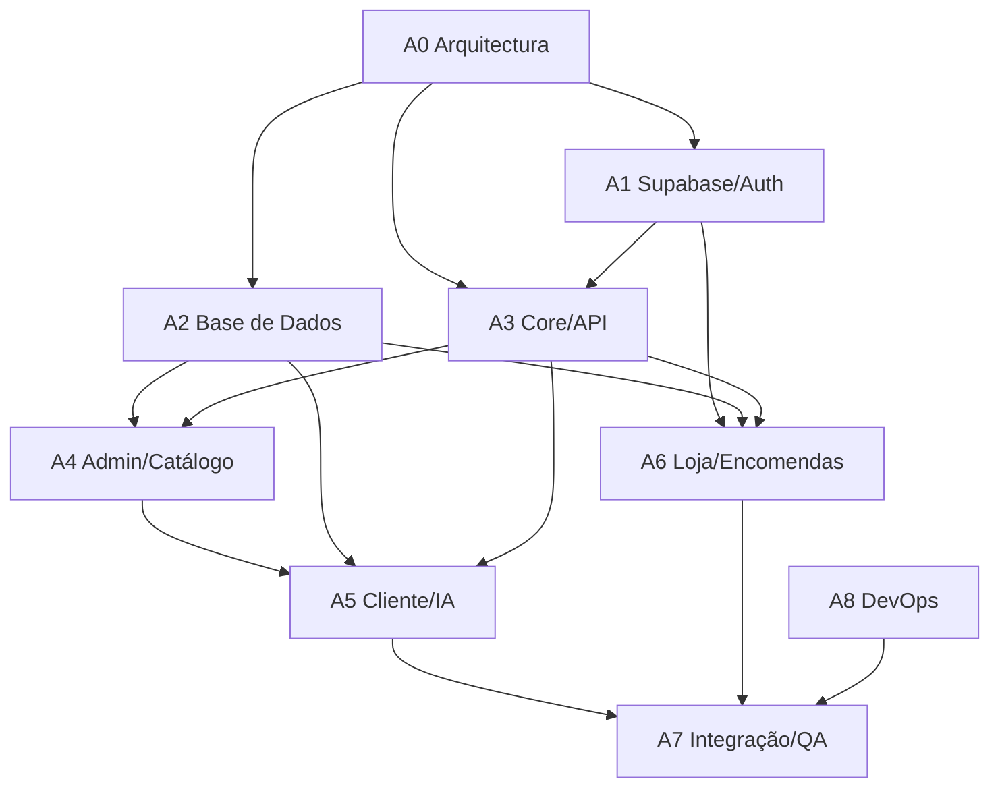

# Ottimizo — Quadro Backend Spring Boot + Supabase

> Quadro operacional para implementar o backend separado em **Spring Boot + Spring AI**, usando **Supabase Database, Auth e Realtime**. Este quadro parte do frontend real (`levesabor-web`) e substitui a orientação antiga de backend em Next.js Route Handlers.

## Convenções do Quadro

- Estados: `[ ] Por fazer`, `[~] Em curso`, `[x] Concluído`, `[!] Bloqueado`.
- Fonte de contrato: frontend actual (`src/types/api.d.ts`, `src/mocks/handlers.ts`) + OpenAPI a actualizar.
- Regra de IA: a IA **não inventa receitas, ingredientes, passos, lojas ou produtos**. Só selecciona, ordena ou resume dados já registados na base de dados.
- Supabase: usar **Auth**, **Postgres** e **Realtime**. Não usar Storage/Edge Functions nesta fase.
- Backend: Spring Boot é a camada de regras, autorização, auditoria, integração IA e compatibilidade `/api/v1`.

## Agentes Especializados

| Agente | Missão | Entregáveis principais |
|---|---|---|
| A0 — Arquitecto Backend | Coordenar arquitectura, contrato e limites entre frontend, Spring Boot e Supabase | Decisões técnicas, OpenAPI, mapa de dependências |
| A1 — Especialista Supabase/Auth | Supabase Auth, roles, RLS e Realtime | Auth funcionando, policies, canais realtime |
| A2 — Especialista Base de Dados | Schema, migrations, views e índices | Flyway SQL, views, seeds, performance |
| A3 — Backend Core/API | Fundação Spring Boot, envelope, erros, segurança e paginação | API base, filtros, DTOs, exceptions |
| A4 — Admin/Catálogo | Utilizadores, lojas, ingredientes, receitas e métricas | CRUD admin e views de métricas |
| A5 — Cliente/IA Nutricional | Perfil, geração contextual, receitas, feedback e lista | Plano mensal baseado no catálogo curado |
| A6 — Loja/Encomendas | Produtos, import/export, encomendas e transições | Portal loja suportado por backend real |
| A7 — Integração Frontend/QA | Desligar MSW, validar contrato e executar E2E | Playwright verde contra backend real |
| A8 — DevOps/Observabilidade | Container, ambientes, logs, deploy e monitorização | Deploy staging/prod e runbooks |

---

# A0 — Arquitecto Backend

## Backlog

- [x] **A0-01 · Congelar decisões de arquitectura**
  - Confirmar oficialmente: Spring Boot Java 21, Supabase Auth/Postgres/Realtime, Spring AI, Flyway, container gerido.
  - Registar que Vercel fica só para frontend, se continuar a ser usado.
  - Definir padrão de módulos: `auth`, `users`, `profile`, `catalog`, `mealplan`, `shopping`, `stores`, `orders`, `admin`, `loja`, `ai`, `audit`, `common`.

- [ ] **A0-02 · Actualizar contrato OpenAPI**
  - Converter o contrato actual de `src/types/api.d.ts` para OpenAPI canónico.
  - Manter `ApiResponse<T>`, `PageResponse`, códigos `LSAxxx`, rotas `/api/v1`.
  - Decidir compatibilidade dos endpoints `/auth/register`, `/auth/login`, `/auth/refresh`, `/auth/logout` com Supabase Auth.

- [ ] **A0-03 · Mapear frontend → backend**
  - Criar matriz rota frontend/hook → endpoint → service → tabelas.
  - Cobrir cliente, admin e loja.
  - Identificar endpoints que hoje só existem no mock.

- [ ] **A0-04 · Definir política de IA**
  - Especificar que geração de plano recebe catálogo elegível fechado.
  - Especificar que ranking de lojas usa lojas e endereço já registados.
  - Definir resposta esperada da IA sempre por IDs existentes.

## Em curso

- [~] **A0-05 · Quebra do plano antigo**
  - Marcar `03-backend-plan.md` e `04-database-plan.md` como desactualizados nas secções Next.js/Prisma/Supabase-only-DB.
  - Preparar plano de substituição por Spring Boot + Flyway + Supabase Auth/Realtime.

## Concluído

- [x] **A0-06 · Identificação de processos**
  - Cliente: auth, onboarding, plano mensal, receita, feedback, compras, encomendas.
  - Admin: métricas, utilizadores, lojas, receitas, ingredientes.
  - Loja: produtos, import/export, encomendas.

- [x] **A0-08 · Criar quadro de agentes backend**
  - `docs/plano/tasksbackend.md` criado com agentes A0..A8, dependências e sprints.

## Bloqueado

- [!] **A0-07 · Ambiente definitivo de produção**
  - Bloqueado até escolher fornecedor exacto do container gerido.
  - Default provisório: qualquer plataforma com container Java persistente, env vars, TLS e acesso outbound ao Supabase.

---

# A1 — Especialista Supabase/Auth

## Backlog

- [ ] **A1-01 · Configurar Supabase Auth**
  - Activar email/password.
  - Definir política de confirmação de email conforme decisão do produto.
  - Definir redirect URLs por ambiente.

- [x] **A1-02 · Modelar utilizador de aplicação**
  - Criar tabela `users`/`app_users` com `auth_user_id uuid unique references auth.users(id)`.
  - Manter `id bigint` para compatibilidade com frontend.
  - Guardar `role`, `status`, `store_id`, `name`, `email`, `last_login_at`.

- [~] **A1-03 · Integrar JWT Supabase no Spring Security**
  - Validar assinatura/JWKS.
  - Resolver `auth.uid()` para utilizador local.
  - Bloquear utilizador `SUSPENDED`.
  - Expor `CurrentUser{id, authUserId, role, storeId}`.

- [ ] **A1-04 · Implementar endpoints compatíveis de auth**
  - `POST /api/v1/auth/register`: chama Supabase Auth e cria utilizador local `CLIENTE`.
  - `POST /api/v1/auth/login`: delega login Supabase e devolve `AuthResult`.
  - `POST /api/v1/auth/refresh`: compatível com frontend, se mantido.
  - `POST /api/v1/auth/logout`: termina sessão Supabase/local.

- [ ] **A1-05 · Definir RLS**
  - Cliente só acede aos próprios dados.
  - Lojista só acede a dados da sua loja.
  - Admin lê/escreve domínios administrativos.
  - Backend com service role apenas no servidor.

- [ ] **A1-06 · Activar Supabase Realtime**
  - Publicar tabelas via Flyway quando a publicação `supabase_realtime` existir: `meal_generations`, `ad_hoc_recipe_requests`, `meal_plan_entries`, `shopping_list_items`, `orders`, `order_items`.
  - Garantir policies para Realtime não vazar dados entre clientes/lojas.

## Em curso

- [~] **A1-03 · Integrar JWT Supabase no Spring Security**
  - Validação JWT configurada por `issuer-uri`/`jwk-set-uri`.
  - Conversão de role a partir de `role` ou `app_metadata.role`.
  - Resolução `auth.uid()` para utilizador local iniciada em `UserContextService`.
  - Falta testar contra Supabase real e endurecer casos de claims ausentes.

## Concluído

- [ ] Nenhuma tarefa concluída.

## Bloqueado

- [!] **A1-07 · Decidir se frontend usa Supabase SDK directamente**
  - Se usar SDK no frontend, o fluxo de auth muda.
  - Default: manter endpoints `/api/v1/auth/**` para reduzir impacto no frontend.

---

# A2 — Especialista Base de Dados

## Backlog

- [x] **A2-01 · Criar baseline Flyway**
  - `V001__auth_users_audit.sql`.
  - `V002__catalog_recipes_ingredients.sql`.
  - `V003__client_profile_meal_plans_shopping.sql`.
  - `V004__stores_products_orders.sql`.
  - `V005__views_indexes_realtime_rls.sql`.

- [x] **A2-02 · Schema Auth/Profile/Audit**
  - `users` ligado a `auth.users`.
  - `client_profiles` com múltiplas condições de saúde.
  - `audit_log` para acessos sensíveis e mudanças críticas.

- [x] **A2-03 · Schema Catálogo Curado**
  - `ingredients`.
  - `recipes`.
  - `recipe_ingredients`.
  - `recipe_steps`.
  - `meal_feedback`.
  - `recipe_swap_reasons`.

- [x] **A2-04 · Schema Plano Mensal**
  - `meal_generations`.
  - `meal_plans` com `month_start`.
  - `meal_plan_days`.
  - `meal_plan_entries` com `recipe_snapshot`.
  - Suportar `completed`, feedback e slots do frontend.

- [x] **A2-05 · Schema Lista de Compras**
  - `shopping_lists`.
  - `shopping_list_items`.
  - Campos `have_quantity`, `origin`, `estimated_cost_mt`, `checked`.
  - Garantir que itens `MANUAL` sobrevivem a regenerações.

- [x] **A2-06 · Schema Loja e Encomendas**
  - `stores` com província, cidade, bairro, endereço, rating, horário, entrega, preço médio e coordenadas.
  - `products` por `store_id`.
  - `import_jobs`.
  - `orders` e `order_items` com snapshots.

- [x] **A2-07 · Views operacionais**
  - `v_recipe_feedback_summary`.
  - `v_store_product_counts`.
  - `v_order_status_counts`.
  - `v_admin_metrics_daily`.
  - `v_admin_recipe_list`.
  - `v_user_engagement_monthly`.

- [x] **A2-08 · Índices e constraints**
  - Unique parcial para um plano activo por cliente.
  - Índices por `user_id`, `store_id`, `status`, datas e busca.
  - GIN para `health_tags` e arrays de perfil quando aplicável.

- [x] **A2-09 · Cache de ranking de lojas**
  - Criar tabela `store_rankings_cache`.
  - Chave: `user_id + address_hash`.
  - Guardar ranking, score, motivo, TTL, versão de lojas.
  - Invalidar por mudança de endereço ou loja.

- [x] **A2-11 · Auditoria técnica de IA**
  - Criar `ai_generation_log`.
  - Ligar a `meal_generations`, `meal_plans` e pedidos avulsos.
  - Guardar modelo, tokens, duração, resultado e erro resumido.

## Em curso

- [ ] Nenhuma tarefa em curso.

## Concluído

- [ ] Nenhuma tarefa concluída.

## Bloqueado

- [!] **A2-10 · Dados seed reais**
  - Bloqueado até haver catálogo inicial validado pelo cliente.
  - Mínimo recomendado: 40 receitas publicáveis e 30 ingredientes.

---

# A3 — Backend Core/API

## Backlog

- [x] **A3-01 · Criar projecto Spring Boot**
  - Java 21.
  - Spring Web, Security, Validation, Data JPA, Flyway, Actuator.
  - PostgreSQL driver, springdoc-openapi, Spring AI.

- [x] **A3-02 · Implementar contrato comum**
  - `ApiResponse<T>`.
  - `PageResponse<T>`.
  - `ErrorCode LSAxxx`.
  - `ServiceException`.
  - `GlobalExceptionHandler`.

- [ ] **A3-03 · Implementar paginação e filtros**
  - `page`, `size`, `sort`, `q`.
  - Normalizar resposta para o frontend.

- [~] **A3-04 · Implementar segurança por role**
  - Guards para `/me/**`, `/admin/**`, `/loja/**`.
  - Ownership em services, não apenas no controller.

- [ ] **A3-05 · Implementar auditoria**
  - `AuditService.record(...)`.
  - Auditar acesso a perfil de saúde.
  - Auditar suspensão, publicação, import aplicado e mudança de encomenda.

- [~] **A3-06 · Configurar observabilidade base**
  - `correlationId`.
  - Logs JSON.
  - Actuator health/readiness.
  - Métricas HTTP e DB.

## Em curso

- [ ] Nenhuma tarefa em curso.

## Concluído

- [ ] Nenhuma tarefa concluída.

## Bloqueado

- [!] **A3-07 · Contrato final de Auth**
  - Depende de A1-07.

---

# A4 — Admin/Catálogo

## Backlog

- [ ] **A4-01 · Gestão de utilizadores**
  - `GET /admin/users`.
  - `GET /admin/users/{id}`.
  - `POST /admin/users` para admin/lojista.
  - `PATCH /admin/users/{id}/status`.
  - Bloquear suspensão do último admin activo.

- [ ] **A4-02 · Perfil de saúde auditado**
  - `GET /admin/users/{id}/health-profile`.
  - Exigir clique explícito no frontend.
  - Registar `HEALTH_PROFILE_VIEWED`.

- [ ] **A4-03 · CRUD lojas**
  - `GET/POST /admin/stores`.
  - `GET/PUT/DELETE /admin/stores/{id}`.
  - `PATCH /admin/stores/{id}/status`.
  - Loja suspensa não aparece em `GET /stores`.

- [ ] **A4-04 · CRUD ingredientes**
  - `GET/POST /admin/ingredients`.
  - `GET/PUT/DELETE /admin/ingredients/{id}`.
  - Bloquear delete se ingrediente estiver em uso.
  - Permitir desactivar.

- [ ] **A4-05 · CRUD receitas**
  - `GET/POST /admin/recipes`.
  - `GET/PUT/DELETE /admin/recipes/{id}`.
  - `PATCH /admin/recipes/{id}/status`.
  - Validar publicação: ingredientes, passos, macros, tags.

- [ ] **A4-06 · Motivos recentes de troca**
  - `GET /admin/recipes/{id}/swap-reasons`.
  - Ler `recipe_swap_reasons`, mais recentes primeiro.

- [ ] **A4-07 · Métricas admin**
  - `GET /admin/metrics/summary?period=7|30|90`.
  - Usar views para performance.
  - Incluir planos, IA, utilizadores, receitas, pedidos avulsos, encomendas e engagement.

## Em curso

- [ ] Nenhuma tarefa em curso.

## Concluído

- [ ] Nenhuma tarefa concluída.

## Bloqueado

- [!] **A4-08 · Copy/labels finais de validação**
  - Bloqueado se mensagens de erro finais tiverem de seguir revisão de marca/copy.

---

# A5 — Cliente/IA Nutricional

## Backlog

- [ ] **A5-01 · Perfil do cliente**
  - `GET /me/profile`.
  - `PUT /me/profile`.
  - Suportar `healthConditions[]`, `OUTRA`, alergias, exclusões, preferências, `householdSize`, endereço de compras.

- [ ] **A5-02 · Catálogo navegável de receitas**
  - `GET /me/recipes?tags=&q=`.
  - Apenas receitas `PUBLISHED`.
  - Filtrar por tags e pesquisa.

- [ ] **A5-03 · Serviço de catálogo elegível**
  - Ler perfil + receitas publicadas + ingredientes + feedback.
  - Aplicar regras duras antes da IA: alergias, condições, exclusões, orçamento, preferências.
  - Retornar lista fechada de candidatos.

- [ ] **A5-04 · Geração contextual de plano mensal**
  - `POST /me/meal-plans`.
  - Criar `meal_generations` em `GENERATING`.
  - Enviar apenas candidatos da BD para Spring AI.
  - Validar que a resposta só contém `recipeId` existentes.
  - Persistir `meal_plans`, `meal_plan_days`, `meal_plan_entries`.
  - Criar snapshots imutáveis de receitas/passos.

- [ ] **A5-05 · Polling/Realtime de geração**
  - `GET /me/meal-plans/{id}` para estado.
  - Publicar alterações via Supabase Realtime.
  - `GET /me/meal-plans/active`.

- [ ] **A5-06 · Detalhe e progresso de refeições**
  - `GET /me/meal-plans/entries/{id}`.
  - `PATCH /me/meal-plans/entries/{id}/completed`.
  - Actualizar engagement e Realtime.

- [ ] **A5-07 · Feedback e troca**
  - `PUT /me/recipes/{id}/feedback`.
  - `POST /me/meal-plans/entries/{id}/swap`.
  - Guardar motivo livre em `recipe_swap_reasons`.
  - Recriar lista de compras após troca confirmada.

- [ ] **A5-08 · Pedido de receita avulsa**
  - `POST /me/recipes/adhoc`.
  - `GET /me/recipes/adhoc/{id}`.
  - Usar catálogo elegível, não IA livre.
  - `POST /me/meal-plans/entries/{id}/replace`.

- [ ] **A5-09 · Lista de compras**
  - `GET /me/shopping-list`.
  - Agregar ingredientes do plano mensal.
  - Escalar por `householdSize`.
  - Arredondar embalagens quando aplicável.
  - Calcular custo parcial.

- [ ] **A5-10 · Interacções na lista**
  - `PATCH /me/shopping-list/items/{id}` com `checked` e `haveQuantity`.
  - `POST /me/shopping-list/items` para item manual.
  - Preservar itens manuais em regenerações.

- [~] **A5-11 · Ranking de lojas por endereço**
  - `GET /stores`.
  - Ler endereço de compras do perfil.
  - Ler lojas activas da BD.
  - Consultar cache `store_rankings_cache`.
  - Se cache falhar, chamar Spring AI para ordenar mais próximo → mais distante.
  - Guardar ranking por cliente/endereço.

## Em curso

- [~] **A5-11 · Ranking de lojas por endereço**
  - Endpoint `GET /api/v1/stores` criado.
  - Lê perfil e lojas activas da base.
  - Chama Spring AI para ordenação e cai para ordenação determinística se a IA falhar.
  - Guarda cache por `user_id + address_hash`.
  - Falta validar contra Supabase real e alinhar resposta final com o frontend.

## Concluído

- [ ] Nenhuma tarefa concluída.

## Bloqueado

- [!] **A5-12 · Qualidade do catálogo**
  - Bloqueado para testes reais enquanto o admin não tiver receitas publicadas suficientes.

---

# A6 — Loja/Encomendas

## Backlog

- [ ] **A6-01 · Ownership lojista**
  - Resolver `store_id` do utilizador autenticado.
  - Nunca aceitar `storeId` vindo do body/path para operações da loja.
  - Bloquear loja suspensa.

- [ ] **A6-02 · Produtos da loja**
  - `GET /loja/products`.
  - `POST /loja/products`.
  - `GET/PUT/DELETE /loja/products/{id}`.
  - `PATCH /loja/products/{id}/status`.
  - Nome único por loja.

- [ ] **A6-03 · Bloqueio de remoção de produto**
  - Produto referenciado por encomenda activa não pode ser removido.
  - Estados activos: `PENDENTE`, `ACEITE`, `EM_PREPARACAO`, `PRONTA`.
  - Sugerir desactivar em vez de remover.

- [ ] **A6-04 · Import Excel**
  - `GET /loja/products/import-template`.
  - `GET /loja/products/export`.
  - `POST /loja/products/import`.
  - Validar `.xlsx`, tamanho, cabeçalhos, linhas.
  - Criar `import_jobs`.

- [ ] **A6-05 · Confirmar import**
  - `POST /loja/products/import/{jobId}/confirm`.
  - Upsert por nome dentro da loja.
  - Aplicar transacção e auditar.

- [ ] **A6-06 · Encomendas da loja**
  - `GET /loja/orders`.
  - `GET /loja/orders/{id}`.
  - Filtrar sempre por `store_id`.

- [ ] **A6-07 · Máquina de estados**
  - `PATCH /loja/orders/{id}/status`.
  - Permitir `PENDENTE -> ACEITE|RECUSADA`.
  - Permitir `ACEITE -> EM_PREPARACAO|RECUSADA`.
  - Permitir `EM_PREPARACAO -> PRONTA`.
  - Permitir `PRONTA -> CONCLUIDA`.
  - `CANCELADA` só pelo cliente.

- [ ] **A6-08 · Encomendas do cliente**
  - `POST /me/orders`.
  - `GET /me/orders`.
  - `GET /me/orders/{id}`.
  - `PATCH /me/orders/{id}/cancel`.
  - Criar snapshots de loja, cliente e itens.

## Em curso

- [ ] Nenhuma tarefa em curso.

## Concluído

- [ ] Nenhuma tarefa concluída.

## Bloqueado

- [!] **A6-09 · Formato final do Excel**
  - Bloqueado até fixar template final de import/export.

---

# A7 — Integração Frontend/QA

## Backlog

- [ ] **A7-01 · Validar contrato gerado**
  - Gerar OpenAPI do Spring Boot.
  - Regenerar `src/types/api.d.ts`.
  - Comparar diffs e corrigir divergências.

- [ ] **A7-02 · Ligar frontend ao backend real**
  - Configurar `NEXT_PUBLIC_API_URL`.
  - Desligar `NEXT_PUBLIC_USE_MOCKS`.
  - Garantir CORS e cookies/auth.

- [ ] **A7-03 · Suite cliente**
  - Registo/login.
  - Onboarding.
  - Geração de plano.
  - Receita, feedback, troca.
  - Lista de compras.
  - Pedido avulso.
  - Encomenda.

- [ ] **A7-04 · Suite admin**
  - Dashboard.
  - Utilizadores.
  - Lojas.
  - Receitas.
  - Ingredientes.
  - Perfil de saúde auditado.

- [ ] **A7-05 · Suite loja**
  - Login lojista.
  - Produtos.
  - Import/export.
  - Encomendas.
  - Transições de estado.

- [ ] **A7-06 · Testes Realtime**
  - Plano fica READY sem refresh manual.
  - Lista actualiza.
  - Cliente vê estado de encomenda mudado pela loja.
  - Loja vê nova encomenda do cliente.

- [ ] **A7-07 · Testes de autorização**
  - Cliente não acede admin/loja.
  - Lojista não acede outra loja.
  - Admin não fica sem último admin activo.
  - Conta suspensa é bloqueada.

## Em curso

- [ ] Nenhuma tarefa em curso.

## Concluído

- [ ] Nenhuma tarefa concluída.

## Bloqueado

- [!] **A7-08 · Ambiente E2E estável**
  - Depende de backend staging, Supabase staging e seed controlado.

---

# A8 — DevOps/Observabilidade

## Backlog

- [ ] **A8-01 · Container Docker**
  - Dockerfile multi-stage.
  - Java 21 runtime.
  - Healthcheck.
  - Config por env vars.

- [ ] **A8-02 · Ambientes**
  - `local`.
  - `staging`.
  - `production`.
  - Separar Supabase project/keys por ambiente.

- [ ] **A8-03 · CI**
  - Build.
  - Testes unitários.
  - Testes integração com Postgres.
  - Validação Flyway.
  - Publicação de imagem.

- [ ] **A8-04 · Deploy staging**
  - Provisionar container gerido.
  - Configurar variáveis.
  - Rodar migrations.
  - Smoke tests.

- [ ] **A8-05 · Deploy produção**
  - Checklist de release.
  - Backup antes de migrations.
  - Rollback documentado.
  - Smoke tests pós-deploy.

- [ ] **A8-06 · Logs e métricas**
  - Logs JSON com `correlationId`.
  - Métricas Actuator.
  - Alertas para erro IA, falha DB, latência e 5xx.

- [ ] **A8-07 · Backup e restore**
  - Agendar backup Supabase.
  - Testar restore em staging.
  - Documentar RPO/RTO.

## Em curso

- [ ] Nenhuma tarefa em curso.

## Concluído

- [ ] Nenhuma tarefa concluída.

## Bloqueado

- [!] **A8-08 · Fornecedor final de hosting**
  - Bloqueado até decisão comercial/técnica do container gerido.

---

# Dependências Entre Agentes

# Roadmap De Execução

## Sprint 0 — Contrato E Fundação

- [x] A0-01 · Congelar decisões de arquitectura.
- [ ] A0-02 · Actualizar contrato OpenAPI.
- [x] A3-01 · Criar projecto Spring Boot.
- [x] A3-02 · Implementar contrato comum.
- [ ] A8-01 · Container Docker.

## Sprint 1 — Supabase E Base

- [ ] A1-01 · Configurar Supabase Auth.
- [x] A1-02 · Modelar utilizador de aplicação.
- [x] A2-01 · Criar baseline Flyway.
- [x] A2-02 · Schema Auth/Profile/Audit.
- [~] A3-04 · Segurança por role.

## Sprint 2 — Admin E Catálogo Curado

- [ ] A4-01 · Gestão de utilizadores.
- [ ] A4-03 · CRUD lojas.
- [ ] A4-04 · CRUD ingredientes.
- [ ] A4-05 · CRUD receitas.
- [ ] A4-07 · Métricas admin.

## Sprint 3 — Cliente E IA Contextual

- [ ] A5-01 · Perfil do cliente.
- [ ] A5-03 · Serviço de catálogo elegível.
- [ ] A5-04 · Geração contextual de plano mensal.
- [ ] A5-09 · Lista de compras.
- [~] A5-11 · Ranking de lojas por endereço.

## Sprint 4 — Loja E Encomendas

- [ ] A6-01 · Ownership lojista.
- [ ] A6-02 · Produtos da loja.
- [ ] A6-04 · Import Excel.
- [ ] A6-06 · Encomendas da loja.
- [ ] A6-08 · Encomendas do cliente.

## Sprint 5 — Realtime, QA E Deploy

- [ ] A1-06 · Activar Supabase Realtime.
- [ ] A7-01 · Validar contrato gerado.
- [ ] A7-03 · Suite cliente.
- [ ] A7-04 · Suite admin.
- [ ] A7-05 · Suite loja.
- [ ] A8-04 · Deploy staging.

# Critérios De Pronto

- [ ] Frontend funciona com MSW desligado.
- [ ] OpenAPI gerado pelo Spring Boot regenera os tipos sem quebra.
- [ ] Cliente gera plano apenas com receitas registadas e publicadas pelo admin.
- [ ] `GET /stores` ordena lojas por endereço do cliente e usa cache.
- [ ] Admin vê métricas reais derivadas da base.
- [ ] Loja só vê produtos/encomendas da sua loja.
- [ ] Realtime actualiza plano/lista/encomendas sem refresh manual.
- [ ] Playwright cliente/admin/loja passa contra backend real.
